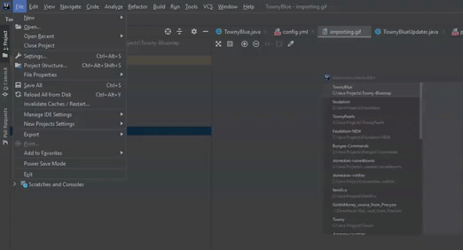

## TownyBlue
Adds Town borders to your BlueMap.

 

 
### Building
Requires Intellij IDE.
***
- Import the Project into the IDE by opening the folder which the /src folder is in.

***
- You'll need to resolve the dependencies, go to Project Structure and Import the Jar Files provided below:

https://github.com/TownyAdvanced/Towny/releases

https://repo1.maven.org/maven2/com/flowpowered/flow-math/1.0.0/flow-math-1.0.0.jar

https://github.com/BlueMap-Minecraft/BlueMapAPI/releases

***
- Next, create an artifact, and make sure to remove all dependencies from the export, otherwise you'll have a very large filesize.

***
- Export the artifact, you'll find it in /out/artifacts

